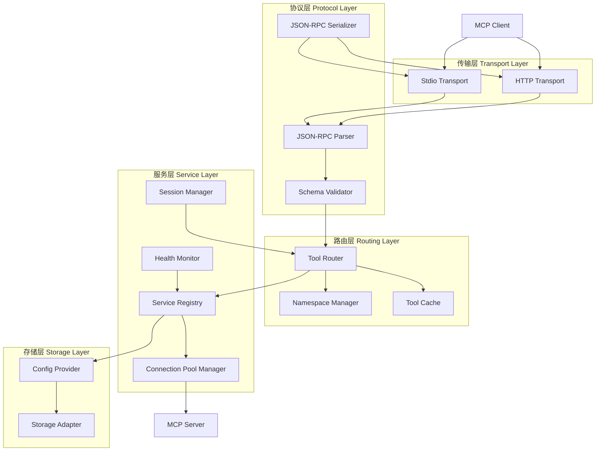
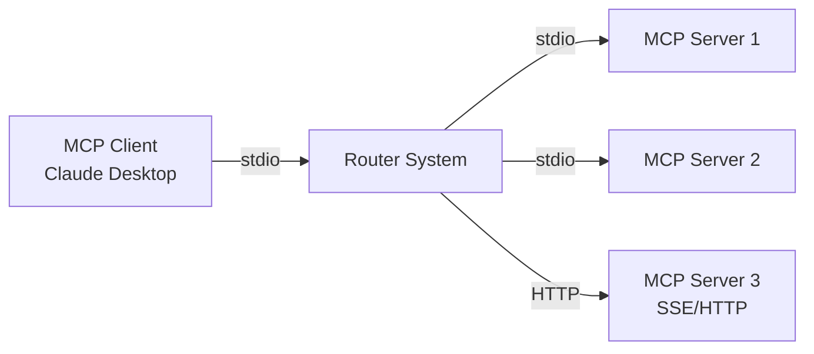
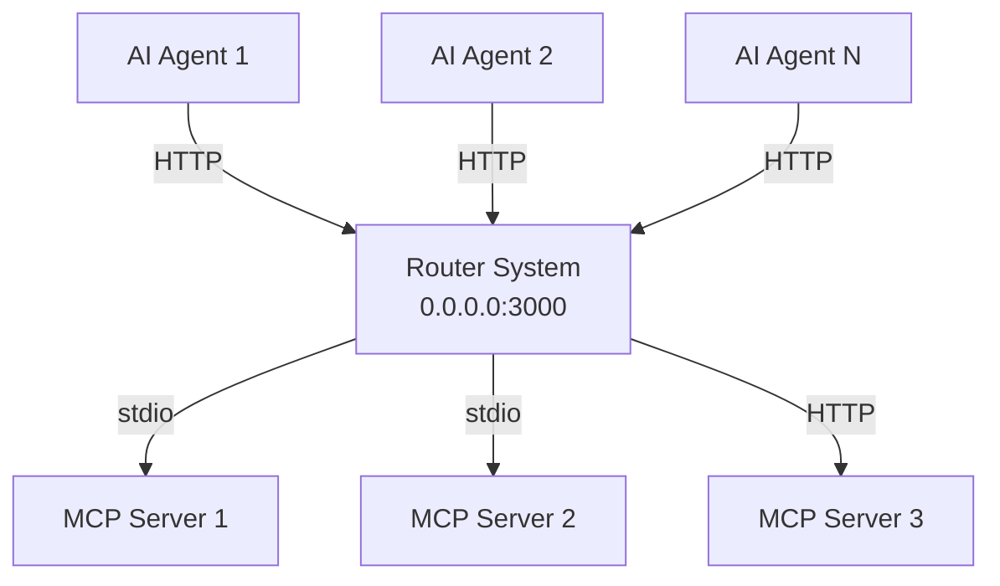
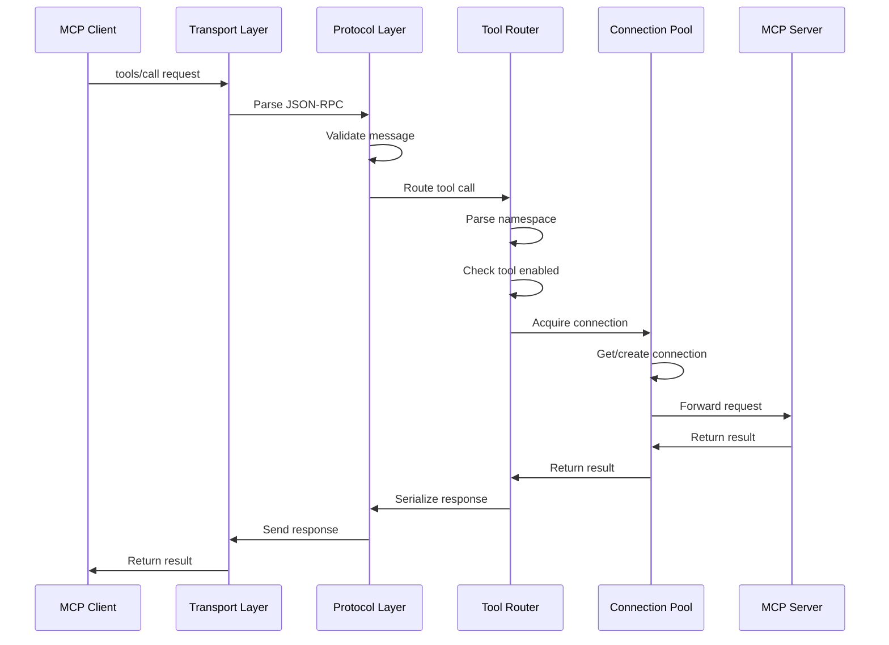
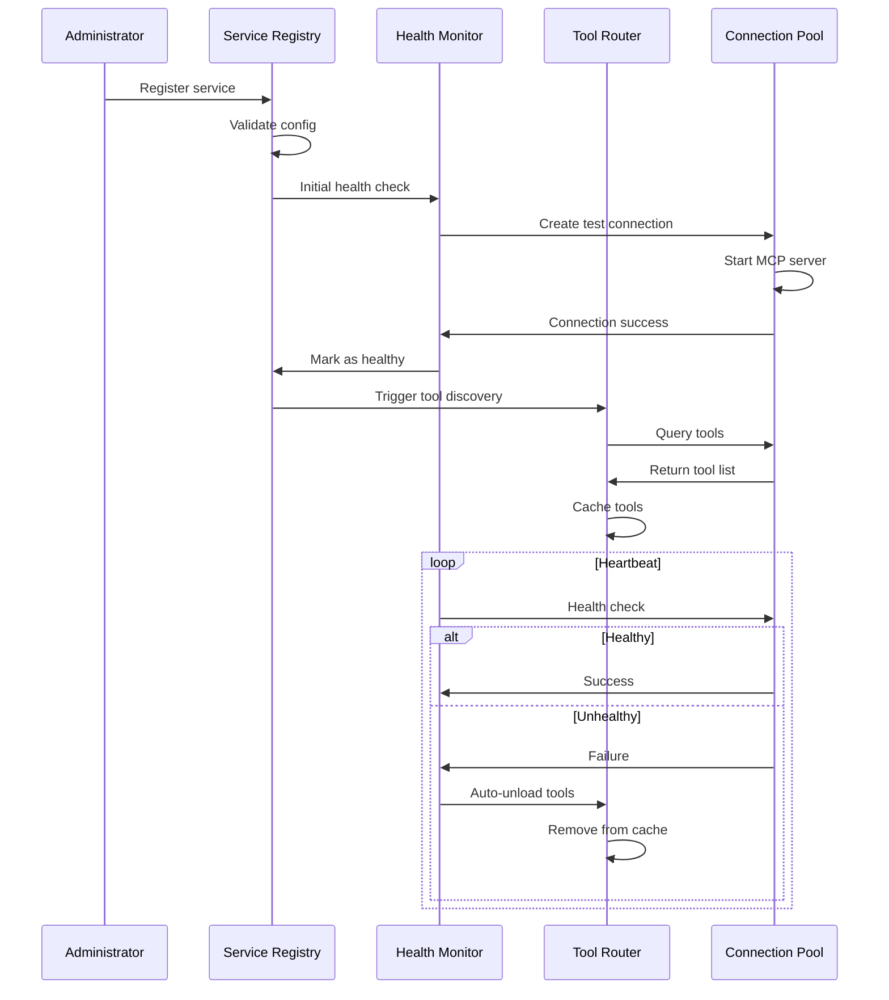
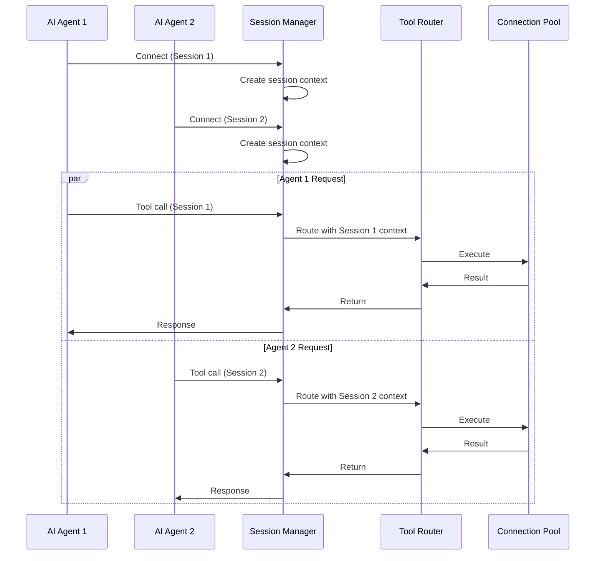
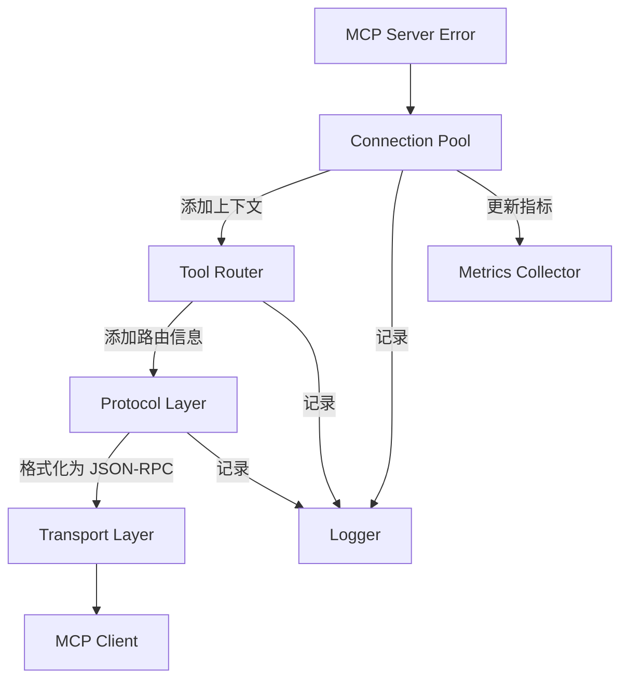

# 设计文档：MCP 路由系统

## 概述

MCP 路由系统是一个基于 Node.js 的中间件服务，作为 MCP 客户端和多个后端 MCP 服务器之间的智能路由层。系统的核心价值在于：

1. **服务聚合**：将多个独立的 MCP 服务器统一到单一接口，简化客户端集成
2. **工具命名空间**：通过命名空间机制避免工具名称冲突，支持同名工具共存
3. **连接池管理**：优化资源使用，通过连接复用提高性能
4. **灵活部署**：支持 CLI（stdio）和 Server（HTTP）两种模式，适应不同场景
5. **多协议支持**：支持 stdio、SSE 和 Streamable HTTP 三种传输协议
6. **多会话隔离**：支持多个 AI Agent 并发连接，确保会话间完全隔离
7. **健康监控**：自动检测服务健康状态，实现工具的自动加载/卸载
8. **可扩展架构**：通过插件化的配置提供者和存储适配器支持多种数据源

### 系统边界

**系统内部**：
- JSON-RPC 2.0 协议处理（解析、验证、序列化）
- 服务注册表和生命周期管理
- 工具发现、缓存和路由
- 连接池管理和负载均衡
- 健康检查和自动恢复
- 配置管理和持久化
- 日志记录和审计追踪
- TUI 配置界面
- 多会话管理和隔离

**系统外部**：
- MCP 客户端（如 Claude Desktop、Cursor IDE）
- 后端 MCP 服务器进程
- 配置存储后端（文件系统、数据库等）
- 日志收集系统
- 监控和指标系统

### 关键设计决策

1. **命名空间策略**：使用 `{serviceName}__{toolName}` 格式确保工具名称唯一性，双下划线作为分隔符避免与单下划线冲突

2. **连接池设计**：每个服务维护独立的连接池，支持配置最大连接数、空闲超时和连接超时，使用队列处理超载情况

3. **多协议支持**：抽象传输层接口，统一处理 stdio、SSE 和 Streamable HTTP 三种协议，根据服务配置动态选择

4. **会话隔离**：在 Server 模式下为每个 AI Agent 创建独立会话，使用会话 ID 隔离请求上下文、日志和指标

5. **健康监控**：实现心跳机制，自动卸载不健康服务的工具，恢复后自动重新加载

6. **配置架构**：分离配置提供者（加载/保存逻辑）和存储适配器（持久化机制），支持插件化扩展

7. **错误处理**：使用 JSON-RPC 2.0 标准错误格式，包含详细上下文和 Correlation ID，支持错误传播和追踪

## 架构

### 高层架构

系统采用分层架构，从上到下分为传输层、协议层、路由层、服务层和存储层：



### 部署架构

系统支持两种部署模式：

**CLI 模式**：


**Server 模式**：



## 组件和接口

### 核心组件

#### 1. Transport Layer（传输层）

**职责**：处理与客户端和服务器的底层通信

**接口**：
```typescript
interface Transport {
  // 发送消息到客户端/服务器
  send(message: JsonRpcMessage): Promise<void>;
  
  // 接收消息（返回异步迭代器）
  receive(): AsyncIterator<JsonRpcMessage>;
  
  // 关闭连接
  close(): Promise<void>;
  
  // 获取传输类型
  getType(): 'stdio' | 'sse' | 'http';
}

// Stdio 传输实现
class StdioTransport implements Transport {
  constructor(private process: ChildProcess) {}
  // 实现接口方法...
}

// HTTP 传输实现（SSE 和 Streamable HTTP）
class HttpTransport implements Transport {
  constructor(private url: string, private mode: 'sse' | 'http') {}
  // 实现接口方法...
}
```

#### 2. Protocol Layer（协议层）

**职责**：解析、验证和序列化 JSON-RPC 2.0 消息

**接口**：
```typescript
interface JsonRpcMessage {
  jsonrpc: '2.0';
  id?: string | number;
  method?: string;
  params?: unknown;
  result?: unknown;
  error?: JsonRpcError;
}

interface JsonRpcError {
  code: number;
  message: string;
  data?: unknown;
}

class JsonRpcParser {
  // 解析 JSON-RPC 消息
  parse(raw: string): JsonRpcMessage;
  
  // 验证消息格式
  validate(message: JsonRpcMessage): ValidationResult;
}

class JsonRpcSerializer {
  // 序列化消息
  serialize(message: JsonRpcMessage): string;
  
  // 格式化消息（用于日志）
  prettyPrint(message: JsonRpcMessage): string;
}
```

#### 3. Service Registry（服务注册表）

**职责**：管理服务的注册、注销和查询

**接口**：
```typescript
interface ServiceDefinition {
  name: string;
  transport: 'stdio' | 'sse' | 'http';
  command?: string;  // stdio 必需
  args?: string[];   // stdio 可选
  env?: Record<string, string>;  // stdio 可选
  url?: string;      // sse/http 必需
  tags?: string[];
  enabled: boolean;
  connectionPool?: ConnectionPoolConfig;
  toolStates?: Record<string, boolean>;  // 工具启用/禁用状态
}

interface ConnectionPoolConfig {
  maxConnections: number;
  idleTimeout: number;
  connectionTimeout: number;
}

class ServiceRegistry {
  // 注册服务
  register(service: ServiceDefinition): Promise<void>;
  
  // 注销服务
  unregister(serviceName: string): Promise<void>;
  
  // 获取服务
  get(serviceName: string): ServiceDefinition | undefined;
  
  // 列出所有服务
  list(filter?: TagFilter): ServiceDefinition[];
  
  // 按标签查询
  findByTags(tags: string[], logic: 'AND' | 'OR'): ServiceDefinition[];
}
```

#### 4. Connection Pool Manager（连接池管理器）

**职责**：管理与后端服务的连接池

**接口**：
```typescript
interface Connection {
  id: string;
  transport: Transport;
  state: 'idle' | 'busy' | 'closed';
  lastUsed: Date;
  createdAt: Date;
}

class ConnectionPool {
  constructor(
    private service: ServiceDefinition,
    private config: ConnectionPoolConfig
  ) {}
  
  // 获取可用连接
  acquire(): Promise<Connection>;
  
  // 释放连接
  release(connection: Connection): void;
  
  // 关闭所有连接
  closeAll(): Promise<void>;
  
  // 获取池统计信息
  getStats(): PoolStats;
}

interface PoolStats {
  total: number;
  idle: number;
  busy: number;
  waiting: number;
}
```

#### 5. Tool Router（工具路由器）

**职责**：路由工具调用到正确的服务

**接口**：
```typescript
interface Tool {
  name: string;              // 原始工具名
  namespacedName: string;    // 命名空间名称
  serviceName: string;
  description: string;
  inputSchema: object;
  enabled: boolean;
}

class ToolRouter {
  // 发现所有工具
  discoverTools(tagFilter?: TagFilter): Promise<Tool[]>;
  
  // 调用工具
  callTool(
    namespacedName: string,
    params: unknown,
    context: RequestContext
  ): Promise<unknown>;
  
  // 启用/禁用工具
  setToolState(namespacedName: string, enabled: boolean): Promise<void>;
  
  // 获取工具状态
  getToolState(namespacedName: string): boolean;
  
  // 使缓存失效
  invalidateCache(): void;
}
```

#### 6. Namespace Manager（命名空间管理器）

**职责**：管理工具命名空间

**接口**：
```typescript
class NamespaceManager {
  // 生成命名空间名称
  generateNamespacedName(serviceName: string, toolName: string): string;
  
  // 解析命名空间名称
  parseNamespacedName(namespacedName: string): {
    serviceName: string;
    toolName: string;
  };
  
  // 清理服务名称中的特殊字符
  sanitizeServiceName(serviceName: string): string;
}
```

#### 7. Health Monitor（健康监控器）

**职责**：监控服务健康状态

**接口**：
```typescript
interface HealthStatus {
  serviceName: string;
  healthy: boolean;
  lastCheck: Date;
  error?: string;
}

class HealthMonitor {
  // 执行健康检查
  checkHealth(serviceName: string): Promise<HealthStatus>;
  
  // 获取所有服务的健康状态
  getAllHealthStatus(): Promise<HealthStatus[]>;
  
  // 启动心跳监控
  startHeartbeat(interval: number): void;
  
  // 停止心跳监控
  stopHeartbeat(): void;
  
  // 订阅健康状态变化事件
  onHealthChange(callback: (status: HealthStatus) => void): void;
}
```

#### 8. Session Manager（会话管理器）

**职责**：管理多个 AI Agent 的会话隔离

**接口**：
```typescript
interface Session {
  id: string;
  agentId: string;
  createdAt: Date;
  lastActivity: Date;
  requestQueue: RequestQueue;
  context: SessionContext;
}

interface SessionContext {
  tagFilter?: TagFilter;
  resourceLimits?: ResourceLimits;
  metadata?: Record<string, unknown>;
}

class SessionManager {
  // 创建新会话
  createSession(agentId: string, context: SessionContext): Session;
  
  // 获取会话
  getSession(sessionId: string): Session | undefined;
  
  // 关闭会话
  closeSession(sessionId: string): Promise<void>;
  
  // 列出所有活动会话
  listActiveSessions(): Session[];
  
  // 清理过期会话
  cleanupExpiredSessions(timeout: number): void;
}
```

#### 9. Config Provider（配置提供者）

**职责**：加载和保存配置

**接口**：
```typescript
interface ConfigProvider {
  // 加载配置
  load(): Promise<SystemConfig>;
  
  // 保存配置
  save(config: SystemConfig): Promise<void>;
  
  // 验证配置
  validate(config: SystemConfig): ValidationResult;
  
  // 监听配置变化
  watch(callback: (config: SystemConfig) => void): void;
}

interface SystemConfig {
  mode: 'cli' | 'server';
  port?: number;
  logLevel: 'DEBUG' | 'INFO' | 'WARN' | 'ERROR';
  services: ServiceDefinition[];
  connectionPool: ConnectionPoolConfig;
  healthCheck: HealthCheckConfig;
  audit: AuditConfig;
}
```

#### 10. Storage Adapter（存储适配器）

**职责**：持久化配置数据

**接口**：
```typescript
interface StorageAdapter {
  // 读取数据
  read(key: string): Promise<string | undefined>;
  
  // 写入数据
  write(key: string, value: string): Promise<void>;
  
  // 更新数据
  update(key: string, value: string): Promise<void>;
  
  // 删除数据
  delete(key: string): Promise<void>;
  
  // 列出所有键
  listKeys(prefix?: string): Promise<string[]>;
}

// 文件系统存储实现
class FileStorageAdapter implements StorageAdapter {
  constructor(private baseDir: string) {}
  // 实现接口方法...
}

// 内存存储实现（用于测试）
class MemoryStorageAdapter implements StorageAdapter {
  private data: Map<string, string> = new Map();
  // 实现接口方法...
}
```

### 关键工作流程

#### 工具调用流程



#### 服务注册和健康检查流程



#### 多会话处理流程



## 数据模型

### 核心数据结构

#### Service Definition（服务定义）
```typescript
interface ServiceDefinition {
  // 基本信息
  name: string;                    // 服务名称（唯一标识符）
  enabled: boolean;                // 是否启用
  tags: string[];                  // 标签列表
  
  // 传输配置
  transport: 'stdio' | 'sse' | 'http';
  
  // Stdio 传输配置（仅当 transport === 'stdio'）
  command?: string;                // 启动命令
  args?: string[];                 // 命令参数
  env?: Record<string, string>;    // 环境变量
  
  // HTTP 传输配置（仅当 transport === 'sse' | 'http'）
  url?: string;                    // 服务 URL
  
  // 连接池配置
  connectionPool: {
    maxConnections: number;        // 最大连接数（默认：5）
    idleTimeout: number;           // 空闲超时（毫秒，默认：60000）
    connectionTimeout: number;     // 连接超时（毫秒，默认：30000）
  };
  
  // 工具状态配置
  toolStates?: {
    [pattern: string]: boolean;    // 工具名称模式 -> 启用状态
  };
}
```

#### Tool Definition（工具定义）
```typescript
interface Tool {
  name: string;                    // 原始工具名称
  namespacedName: string;          // 命名空间名称（serviceName__toolName）
  serviceName: string;             // 所属服务名称
  description: string;             // 工具描述
  inputSchema: {                   // JSON Schema
    type: 'object';
    properties: Record<string, unknown>;
    required?: string[];
  };
  enabled: boolean;                // 是否启用
}
```

#### Request Context（请求上下文）
```typescript
interface RequestContext {
  requestId: string;               // 请求 ID
  correlationId: string;           // 关联 ID
  sessionId?: string;              // 会话 ID（Server 模式）
  agentId?: string;                // AI Agent ID（Server 模式）
  timestamp: Date;                 // 请求时间戳
  tagFilter?: TagFilter;           // 标签过滤器
}
```

#### Health Status（健康状态）
```typescript
interface HealthStatus {
  serviceName: string;             // 服务名称
  healthy: boolean;                // 是否健康
  lastCheck: Date;                 // 最后检查时间
  consecutiveFailures: number;     // 连续失败次数
  error?: {
    message: string;
    code: string;
    timestamp: Date;
  };
}
```

#### Audit Log Entry（审计日志条目）
```typescript
interface AuditLogEntry {
  // 标识符
  requestId: string;
  correlationId: string;
  sessionId?: string;
  agentId?: string;
  
  // 请求信息
  toolName: string;
  serviceName: string;
  connectionId: string;
  
  // 时间信息
  receivedAt: Date;
  routedAt: Date;
  completedAt: Date;
  duration: number;                // 毫秒
  
  // 输入输出（可配置是否记录）
  input?: unknown;
  output?: unknown;
  
  // 状态
  status: 'success' | 'error' | 'timeout';
  error?: {
    code: number;
    message: string;
    stack?: string;
  };
  
  // 路由信息
  routingDecision: {
    poolId: string;
    connectionId: string;
    reason: string;
  };
}
```

### 配置文件格式

#### 主配置文件（config.json）
```json
{
  "mode": "server",
  "port": 3000,
  "logLevel": "INFO",
  "configDir": "~/.onemcp",
  
  "connectionPool": {
    "maxConnections": 5,
    "idleTimeout": 60000,
    "connectionTimeout": 30000
  },
  
  "healthCheck": {
    "enabled": true,
    "interval": 30000,
    "failureThreshold": 3,
    "autoUnload": true
  },
  
  "audit": {
    "enabled": true,
    "level": "standard",
    "logInput": false,
    "logOutput": false,
    "retention": {
      "days": 30,
      "maxSize": "1GB"
    }
  },
  
  "security": {
    "dataMasking": {
      "enabled": true,
      "patterns": ["password", "token", "secret", "key"]
    }
  }
}
```

#### 服务配置文件（services/example.json）
```json
{
  "name": "filesystem",
  "enabled": true,
  "tags": ["local", "storage"],
  "transport": "stdio",
  "command": "npx",
  "args": ["-y", "@modelcontextprotocol/server-filesystem", "/tmp"],
  "env": {
    "NODE_ENV": "production"
  },
  "connectionPool": {
    "maxConnections": 3,
    "idleTimeout": 60000,
    "connectionTimeout": 30000
  },
  "toolStates": {
    "read_file": true,
    "write_file": false,
    "*_directory": true
  }
}
```

#### HTTP 服务配置示例
```json
{
  "name": "remote-api",
  "enabled": true,
  "tags": ["remote", "api"],
  "transport": "http",
  "url": "https://api.example.com/mcp",
  "connectionPool": {
    "maxConnections": 10,
    "idleTimeout": 120000,
    "connectionTimeout": 30000
  }
}
```

## 技术栈

### 核心技术

- **运行时**：Node.js 18+ (支持 ES2022 特性)
- **语言**：TypeScript 5.0+
- **包管理**：npm 或 pnpm
- **构建工具**：tsup（快速 TypeScript 打包）

### 主要依赖

#### 协议和通信
- `@modelcontextprotocol/sdk`：MCP 协议官方 SDK
- `json-rpc-2.0`：JSON-RPC 2.0 实现
- `ajv`：JSON Schema 验证

#### 进程和连接管理
- `execa`：进程执行和管理
- `p-queue`：异步队列管理
- `p-retry`：重试逻辑

#### HTTP 和流式传输
- `fastify`：高性能 HTTP 服务器（Server 模式）
- `eventsource`：SSE 客户端
- `node-fetch`：HTTP 客户端

#### TUI 界面
- `ink`：React 风格的 CLI 界面框架
- `ink-text-input`：文本输入组件
- `ink-select-input`：选择输入组件
- `ink-table`：表格显示组件

#### 配置和存储
- `conf`：配置管理
- `fs-extra`：增强的文件系统操作
- `dotenv`：环境变量管理

#### 日志和监控
- `pino`：高性能日志库
- `pino-pretty`：日志格式化
- `eventemitter3`：事件发射器

#### 测试
- `vitest`：测试框架
- `fast-check`：基于属性的测试库
- `@vitest/coverage-v8`：代码覆盖率

### 开发工具

- `eslint`：代码检查
- `prettier`：代码格式化
- `tsx`：TypeScript 执行器
- `nodemon`：开发时自动重启

## 正确性属性

*属性是系统在所有有效执行中应该保持为真的特征或行为——本质上是关于系统应该做什么的形式化陈述。属性作为人类可读规范和机器可验证正确性保证之间的桥梁。*

在编写正确性属性之前，我需要使用 prework 工具分析需求文档中的验收标准。


### 属性反思

在编写正确性属性之前，我需要审查预分析中识别的所有可测试属性，以消除冗余：

**识别的冗余和合并机会**：

1. **服务注册往返** (1.11) 和 **配置持久化往返** (11.10) 可以合并为一个综合的持久化往返属性
2. **工具状态持久化** (3.4) 已被上述合并覆盖
3. **命名空间生成** (4.1) 和 **命名空间解析** (4.2) 应该合并为一个往返属性
4. **健康检查自动卸载** (20.6) 和 **健康检查自动加载** (20.7) 可以合并为一个综合的健康状态管理属性
5. **会话隔离** (23.7) 和 **并发工具调用隔离** (38.4) 描述相同的隔离保证，应该合并

**保留的唯一属性**：
- 服务注册和配置的往返属性（合并后）
- 工具发现的完整性
- 工具状态管理
- 命名空间往返（合并后）
- 工具路由正确性
- 参数验证
- 连接池复用和限制
- JSON-RPC 协议合规性
- 错误处理格式
- 标签过滤逻辑
- 日志记录完整性
- 健康监控和自动加载/卸载（合并后）
- 批量请求部分失败处理
- 会话隔离（合并后）
- 输入验证和安全性
- JSON-RPC 消息往返
- 配置验证错误报告
- 自动错误恢复

### 属性 1：服务注册往返

*对于任何*有效的服务定义，注册该服务然后检索它应该返回等效的服务定义。

**验证需求：1.11**

### 属性 2：配置持久化往返

*对于任何*系统配置（包括服务定义和工具状态），保存配置、重启系统、然后加载配置应该产生等效的配置对象。

**验证需求：11.10, 3.4**

### 属性 3：工具发现完整性

*对于任何*已注册的已启用服务集合，工具列表应该包含且仅包含所有已启用服务的所有已启用工具。

**验证需求：2.1**

### 属性 4：工具缓存失效

*对于任何*服务注册或注销操作，工具列表应该立即反映变化（缓存失效）。

**验证需求：2.4**

### 属性 5：禁用工具拒绝调用

*对于任何*被禁用的工具，调用该工具应该返回错误而不是执行。

**验证需求：3.1**

### 属性 6：命名空间往返

*对于任何*服务名称和工具名称，生成命名空间名称然后解析应该返回原始的服务名称和工具名称。

**验证需求：4.1, 4.2**

### 属性 7：工具路由正确性

*对于任何*命名空间工具名称和参数，工具调用应该被路由到正确的服务（从命名空间中提取的服务名称）。

**验证需求：5.1**

### 属性 8：参数模式验证

*对于任何*不符合工具输入模式的参数，系统应该拒绝请求并返回验证错误。

**验证需求：5.2**

### 属性 9：连接池复用

*对于任何*服务的多个连续请求，当连接可用时应该复用现有连接而不是创建新连接。

**验证需求：6.1**

### 属性 10：连接池限制强制

*对于任何*服务，当活动连接数达到最大连接数时，新请求应该被排队或拒绝，而不是创建超过限制的连接。

**验证需求：6.5**

### 属性 11：JSON-RPC 请求接受

*对于任何*符合 JSON-RPC 2.0 规范的请求，系统应该接受并处理该请求。

**验证需求：7.1**

### 属性 12：JSON-RPC 响应合规性

*对于任何*请求，系统返回的响应应该符合 JSON-RPC 2.0 规范。

**验证需求：7.2**

### 属性 13：错误响应格式

*对于任何*导致错误的请求，错误响应应该包含错误代码、消息和上下文详细信息。

**验证需求：9.1**

### 属性 14：无效配置拒绝

*对于任何*不符合配置模式的配置文件，系统应该拒绝加载并返回描述性错误消息。

**验证需求：11.7**

### 属性 15：标签 AND 过滤逻辑

*对于任何*标签集合和使用 AND 逻辑的查询，返回的服务应该包含所有指定的标签。

**验证需求：13.5**

### 属性 16：日志包含 Correlation ID

*对于任何*请求，生成的日志条目应该包含该请求的 Correlation ID。

**验证需求：19.5**

### 属性 17：健康状态自动工具管理

*对于任何*服务，当健康检查从健康变为不健康时，其工具应该从工具列表中移除；当从不健康恢复为健康时，其工具应该重新出现在工具列表中。

**验证需求：20.6, 20.7**

### 属性 18：批量请求部分失败隔离

*对于任何*包含多个工具调用的批量请求，一个工具调用的失败不应该阻止其他工具调用的执行，响应应该包含所有成功和失败的结果。

**验证需求：21.4**

### 属性 19：会话完全隔离

*对于任何*两个不同的会话，一个会话中的操作（包括工具调用、错误、状态变化）不应该影响另一个会话的状态或结果。

**验证需求：23.7, 38.4**

### 属性 20：输入参数验证

*对于任何*包含潜在恶意内容（如 SQL 注入、命令注入模式）的输入参数，系统应该拒绝或清理该输入。

**验证需求：24.1**

### 属性 21：JSON-RPC 消息往返

*对于任何*有效的 JSON-RPC 消息对象，序列化然后解析应该产生等效的消息对象。

**验证需求：29.5**

### 属性 22：配置验证错误完整性

*对于任何*包含多个验证错误的配置，验证错误消息应该包含所有错误，而不仅仅是第一个错误。

**验证需求：30.9**

### 属性 23：服务崩溃自动恢复

*对于任何*崩溃的服务，下次对该服务的工具调用应该触发服务重启并成功执行（或返回适当的错误）。

**验证需求：32.1**

## 错误处理

### 错误分类

系统定义以下错误类别，每个类别对应特定的 JSON-RPC 错误代码：

```typescript
enum ErrorCode {
  // JSON-RPC 标准错误
  PARSE_ERROR = -32700,
  INVALID_REQUEST = -32600,
  METHOD_NOT_FOUND = -32601,
  INVALID_PARAMS = -32602,
  INTERNAL_ERROR = -32603,
  
  // MCP 路由系统特定错误
  TOOL_NOT_FOUND = -32001,
  TOOL_DISABLED = -32002,
  SERVICE_UNAVAILABLE = -32003,
  SERVICE_UNHEALTHY = -32004,
  CONNECTION_POOL_EXHAUSTED = -32005,
  TIMEOUT = -32006,
  VALIDATION_ERROR = -32007,
  CONFIGURATION_ERROR = -32008,
  SESSION_ERROR = -32009,
}
```

### 错误响应格式

所有错误响应遵循 JSON-RPC 2.0 标准格式：

```typescript
interface ErrorResponse {
  jsonrpc: '2.0';
  id: string | number | null;
  error: {
    code: number;
    message: string;
    data?: {
      correlationId: string;
      requestId: string;
      sessionId?: string;
      serviceName?: string;
      toolName?: string;
      details?: unknown;
      stack?: string;  // 仅在调试模式
    };
  };
}
```

### 错误处理策略

#### 1. 传输层错误
- **连接失败**：使用指数退避重试，最多重试 3 次
- **超时**：返回 TIMEOUT 错误，包含超时时长信息
- **协议错误**：返回 PARSE_ERROR 或 INVALID_REQUEST

#### 2. 服务层错误
- **服务不可用**：返回 SERVICE_UNAVAILABLE，触发健康检查
- **服务崩溃**：记录错误，标记服务为不健康，自动卸载工具
- **连接池耗尽**：排队请求或返回 CONNECTION_POOL_EXHAUSTED

#### 3. 路由层错误
- **工具不存在**：返回 TOOL_NOT_FOUND
- **工具被禁用**：返回 TOOL_DISABLED
- **参数验证失败**：返回 VALIDATION_ERROR，包含详细的验证错误

#### 4. 配置层错误
- **配置无效**：拒绝加载，返回 CONFIGURATION_ERROR，包含所有验证错误
- **配置文件损坏**：尝试从备份恢复，记录错误

### 错误传播

错误在系统中的传播路径：



### 错误恢复机制

1. **自动重试**：临时性错误（网络超时、连接失败）自动重试
2. **服务重启**：进程崩溃时自动重启服务
3. **健康检查**：定期检查服务健康，自动卸载/加载工具
4. **降级处理**：当服务不可用时，返回明确的错误而不是挂起
5. **配置回滚**：配置更新失败时保持先前的有效配置

## 测试策略

### 双重测试方法

系统采用单元测试和基于属性的测试相结合的方法：

#### 单元测试
- **目的**：验证特定示例、边缘情况和错误条件
- **工具**：Vitest
- **覆盖范围**：
  - 特定的错误场景（如工具不存在、工具被禁用）
  - 边缘情况（如空配置、特殊字符处理）
  - 集成点（如传输层与协议层的交互）
  - 具体的业务逻辑示例

#### 基于属性的测试
- **目的**：验证在所有输入下保持的通用属性
- **工具**：fast-check
- **配置**：每个属性测试至少运行 100 次迭代
- **标签格式**：`Feature: onemcp-system, Property {number}: {property_text}`
- **覆盖范围**：
  - 往返属性（服务注册、配置持久化、命名空间、JSON-RPC 消息）
  - 完整性保证（工具发现、错误响应格式）
  - 状态持久化（工具状态、配置）
  - 并发安全性（会话隔离、连接池）
  - 资源限制（连接池限制、批量大小限制）

### 测试组织

```
tests/
├── unit/                          # 单元测试
│   ├── transport/
│   │   ├── stdio.test.ts
│   │   └── http.test.ts
│   ├── protocol/
│   │   ├── parser.test.ts
│   │   └── serializer.test.ts
│   ├── routing/
│   │   ├── router.test.ts
│   │   └── namespace.test.ts
│   ├── service/
│   │   ├── registry.test.ts
│   │   ├── pool.test.ts
│   │   └── health.test.ts
│   └── config/
│       ├── provider.test.ts
│       └── storage.test.ts
├── property/                      # 基于属性的测试
│   ├── service-registration.property.test.ts
│   ├── tool-discovery.property.test.ts
│   ├── namespace.property.test.ts
│   ├── routing.property.test.ts
│   ├── connection-pool.property.test.ts
│   ├── protocol.property.test.ts
│   ├── error-handling.property.test.ts
│   ├── session-isolation.property.test.ts
│   └── config-validation.property.test.ts
├── integration/                   # 集成测试
│   ├── cli-mode.test.ts
│   ├── server-mode.test.ts
│   ├── multi-service.test.ts
│   └── health-monitoring.test.ts
└── e2e/                          # 端到端测试
    ├── full-workflow.test.ts
    └── mcp-inspector.test.ts
```

### 属性测试示例

```typescript
// Feature: onemcp-system, Property 1: 服务注册往返
describe('Property 1: Service Registration Round Trip', () => {
  it('should preserve service definition after register and retrieve', async () => {
    await fc.assert(
      fc.asyncProperty(
        serviceDefinitionArbitrary(),
        async (serviceDef) => {
          const registry = new ServiceRegistry(storage);
          
          // 注册服务
          await registry.register(serviceDef);
          
          // 检索服务
          const retrieved = await registry.get(serviceDef.name);
          
          // 验证等效性
          expect(retrieved).toEqual(serviceDef);
        }
      ),
      { numRuns: 100 }
    );
  });
});

// Feature: onemcp-system, Property 6: 命名空间往返
describe('Property 6: Namespace Round Trip', () => {
  it('should preserve service and tool names through namespace generation and parsing', () => {
    fc.assert(
      fc.property(
        fc.string({ minLength: 1 }),
        fc.string({ minLength: 1 }),
        (serviceName, toolName) => {
          const manager = new NamespaceManager();
          
          // 生成命名空间名称
          const namespaced = manager.generateNamespacedName(serviceName, toolName);
          
          // 解析命名空间名称
          const parsed = manager.parseNamespacedName(namespaced);
          
          // 验证往返
          expect(parsed.serviceName).toBe(manager.sanitizeServiceName(serviceName));
          expect(parsed.toolName).toBe(toolName);
        }
      ),
      { numRuns: 100 }
    );
  });
});

// Feature: onemcp-system, Property 19: 会话完全隔离
describe('Property 19: Session Complete Isolation', () => {
  it('should isolate operations between different sessions', async () => {
    await fc.assert(
      fc.asyncProperty(
        fc.array(toolCallArbitrary(), { minLength: 2, maxLength: 10 }),
        async (toolCalls) => {
          const sessionManager = new SessionManager();
          const router = new ToolRouter(registry, sessionManager);
          
          // 创建两个会话
          const session1 = sessionManager.createSession('agent1', {});
          const session2 = sessionManager.createSession('agent2', {});
          
          // 在两个会话中并发执行工具调用
          const results1 = await Promise.all(
            toolCalls.map(call => 
              router.callTool(call.name, call.params, { sessionId: session1.id })
            )
          );
          
          const results2 = await Promise.all(
            toolCalls.map(call => 
              router.callTool(call.name, call.params, { sessionId: session2.id })
            )
          );
          
          // 验证结果正确返回给各自的会话
          expect(results1.length).toBe(toolCalls.length);
          expect(results2.length).toBe(toolCalls.length);
          
          // 验证会话状态独立
          expect(session1.context).not.toBe(session2.context);
        }
      ),
      { numRuns: 100 }
    );
  });
});
```

### 测试数据生成器

使用 fast-check 的 arbitrary 生成器创建测试数据：

```typescript
// 服务定义生成器
function serviceDefinitionArbitrary(): fc.Arbitrary<ServiceDefinition> {
  return fc.record({
    name: fc.string({ minLength: 1, maxLength: 50 }),
    enabled: fc.boolean(),
    tags: fc.array(fc.string(), { maxLength: 10 }),
    transport: fc.constantFrom('stdio', 'sse', 'http'),
    command: fc.option(fc.string()),
    args: fc.option(fc.array(fc.string())),
    env: fc.option(fc.dictionary(fc.string(), fc.string())),
    url: fc.option(fc.webUrl()),
    connectionPool: fc.record({
      maxConnections: fc.integer({ min: 1, max: 20 }),
      idleTimeout: fc.integer({ min: 1000, max: 300000 }),
      connectionTimeout: fc.integer({ min: 1000, max: 60000 }),
    }),
  });
}

// JSON-RPC 消息生成器
function jsonRpcMessageArbitrary(): fc.Arbitrary<JsonRpcMessage> {
  return fc.oneof(
    // 请求
    fc.record({
      jsonrpc: fc.constant('2.0'),
      id: fc.oneof(fc.string(), fc.integer()),
      method: fc.string(),
      params: fc.anything(),
    }),
    // 响应
    fc.record({
      jsonrpc: fc.constant('2.0'),
      id: fc.oneof(fc.string(), fc.integer()),
      result: fc.anything(),
    }),
    // 错误响应
    fc.record({
      jsonrpc: fc.constant('2.0'),
      id: fc.oneof(fc.string(), fc.integer(), fc.constant(null)),
      error: fc.record({
        code: fc.integer(),
        message: fc.string(),
        data: fc.option(fc.anything()),
      }),
    })
  );
}
```

### 测试覆盖率目标

- **代码覆盖率**：最低 80%，目标 90%
- **分支覆盖率**：最低 75%，目标 85%
- **属性测试**：每个正确性属性至少一个测试
- **集成测试**：覆盖所有主要工作流程
- **端到端测试**：验证 CLI 和 Server 模式的完整场景

### 持续集成

- 所有测试在每次提交时运行
- 属性测试使用固定的随机种子以确保可重现性
- 失败的属性测试自动记录反例
- 性能测试监控关键操作的延迟和吞吐量

